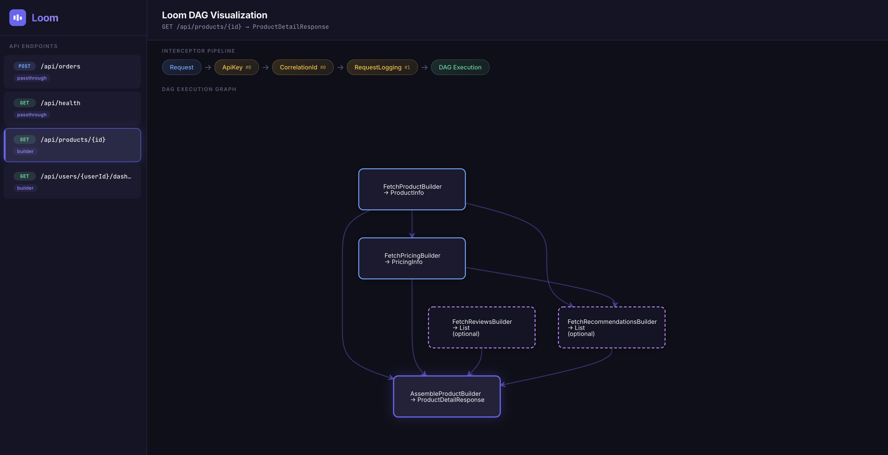

```
╔══════════════════════════════════════════════════════════════════════╗
║                                                                      ║
║     ██╗      ██████╗  ██████╗ ███╗   ███╗                            ║
║     ██║     ██╔═══██╗██╔═══██╗████╗ ████║                            ║
║     ██║     ██║   ██║██║   ██║██╔████╔██║                            ║
║     ██║     ██║   ██║██║   ██║██║╚██╔╝██║                            ║
║     ███████╗╚██████╔╝╚██████╔╝██║ ╚═╝ ██║                            ║
║     ╚══════╝ ╚═════╝  ╚═════╝ ╚═╝     ╚═╝                            ║
║                                                                      ║
║        ─ ─ ═══╦══ ─ ─ ═══╦══ ─ ─ ═══╦══ ─ ─                          ║
║               ║           ║           ║                              ║
║     Scatter ──╬── Gather ─╬── Weave ──╬── Respond                    ║
║               ║           ║           ║                              ║
║        ─ ─ ═══╩══  ─ ─ ═══╩══  ─ ─ ═══╩══ ─ ─                        ║
║                                                                      ║
║     DAG Scatter-Gather ∙ Virtual Threads ∙ Spring Boot ∙ Java 21+    ║
║                                                                      ║
╚══════════════════════════════════════════════════════════════════════╝
```

# Loom Framework

**High Performant Java 21 API Gateway/BFF framework with DAG-based scatter-gather, powered by virtual threads.**

Loom makes it trivial to build API gateways and Backend-for-Frontend (BFF) services that aggregate
data from multiple services. Define your data flow as a directed acyclic graph (DAG), and
Loom executes it with maximum parallelism using virtual threads.

## Features

- **Declarative DAG composition** — Define scatter-gather flows with annotations
- **Unified passthrough** — Proxy service APIs with `@LoomApi` + `@LoomProxy`, inheriting
  interceptors, swagger schemas, and typed request/response for free
- **Virtual thread execution** — Every request, every DAG node, every service call runs on a
  virtual thread
- **Compile-time type safety** — Dependencies reference builder classes, not strings
- **Auto terminal detection** — The builder whose output matches the response type is the terminal
  node
- **Built-in retry with backoff** — Exponential backoff with jitter on virtual threads (sleep is
  free)
- **Interceptor chains** — Request/response interceptors with attribute passing to builders
- **Embedded DAG visualization** — Dark-themed UI at `/loom/ui` powered by D3.js + dagre-d3
- **High-performance JSON** — dsl-json for fast, reflection-free serialization on both response
  writing and service calls
- **Built-in Swagger/OpenAPI** — Auto-generated API docs from `@LoomApi` annotations at
  `/swagger-ui.html`

**Use Loom if your use case looks like this:**

```
                              GET /api/products/{id}
                                       |
                                  Loom Gateway
                              /        |        \
                             /         |         \
                  Product SVC    Pricing SVC    Review SVC        <-- Level 1 (parallel)
                 (ProductInfo)  (PricingInfo)  (ReviewList)
                      |  \         / |               |
                      |   +---+---+  |               |
                      |       |      +--------+      |
                      |       v               |      |
                      |  Recommendations SVC  |      |            <-- Level 2
                      |  (RecommendationList) |      |
                      |       |      |        |      |
                      v       v      v        v      v
                           AssembleProductBuilder                  <-- Level 3 (all 4)
                           (ProductDetailResponse)
```

Three services fan out in parallel, a fourth waits for two of them, and a terminal node assembles
everything.

## Quick Start

### 1. Add Dependencies

```xml

<dependency>
  <groupId>io.loom</groupId>
  <artifactId>loom-spring-boot-starter</artifactId>
  <version>0.1.0-SNAPSHOT</version>
</dependency>
<dependency>
<groupId>io.loom</groupId>
<artifactId>loom-ui</artifactId>
<version>0.1.0-SNAPSHOT</version>
</dependency>
```

> **Server choice:** The starter is server-agnostic — Spring Boot defaults to Tomcat.
> To use Jetty instead (recommended for virtual threads on older Spring Boot versions):
>
> ```xml
> <dependency>
>   <groupId>org.springframework.boot</groupId>
>   <artifactId>spring-boot-starter-web</artifactId>
>   <exclusions>
>     <exclusion>
>       <groupId>org.springframework.boot</groupId>
>       <artifactId>spring-boot-starter-tomcat</artifactId>
>     </exclusion>
>   </exclusions>
> </dependency>
> <dependency>
>   <groupId>org.springframework.boot</groupId>
>   <artifactId>spring-boot-starter-jetty</artifactId>
> </dependency>
> ```

### 2. Define a DAG API

```java

@LoomApi(method = "GET", path = "/api/products/{id}", response = ProductDetailResponse.class)
@LoomGraph({
        @Node(builder = FetchProductBuilder.class, timeoutMs = 3000),
        @Node(builder = FetchPricingBuilder.class, dependsOn = FetchProductBuilder.class),
        @Node(builder = FetchReviewsBuilder.class, required = false, timeoutMs = 2000),
        @Node(builder = FetchRecommendationsBuilder.class, required = false, timeoutMs = 2000,
              dependsOn = {FetchProductBuilder.class, FetchPricingBuilder.class}),
        @Node(builder = AssembleProductBuilder.class,
              dependsOn = {FetchProductBuilder.class, FetchPricingBuilder.class,
                      FetchReviewsBuilder.class, FetchRecommendationsBuilder.class})})
public class ProductDetailApi {}
```

> **Note:** `@LoomApi` classes are auto-registered as Spring beans by the starter — no `@Component`
> needed.

### 3. Implement Builders

```java

@Component
public class FetchProductBuilder implements LoomBuilder<ProductInfo> {
    public ProductInfo build(BuilderContext ctx) {
        // {id} auto-forwarded from incoming request path variables
        return ctx.service("product-service").route("get-product").get(ProductInfo.class);
    }
}

@Component
public class AssembleProductBuilder implements LoomBuilder<ProductDetailResponse> {
    public ProductDetailResponse build(BuilderContext ctx) {
        ProductInfo info = ctx.getDependency(ProductInfo.class);
        PricingInfo pricing = ctx.getDependency(PricingInfo.class);
        Optional<List<Review>> reviews = ctx.getOptionalResultOf(FetchReviewsBuilder.class);
        return new ProductDetailResponse(info, pricing, reviews.orElse(List.of()));
    }
}
```

### 4. Configure Services

```yaml
spring:
  threads:
    virtual:
      enabled: true

loom:
  services:
    product-service:
      url: http://localhost:8081
      retry:
        max-attempts: 3
        initial-delay-ms: 100
      routes:
        get-product:
          path: /products/{id}
          method: GET
        search-products:
          path: /products
          method: GET
    pricing-service:
      url: http://localhost:8082
      routes:
        get-pricing:
          path: /pricing/{id}
          method: GET
          read-timeout-ms: 2000    # route-level timeout override
```

### 5. Add a Passthrough API

Passthrough APIs use `@LoomApi` + `@LoomProxy` — they get interceptors, swagger schemas, and
typed request/response for free. `@LoomProxy` references a named service and route from YAML config:

```java
@LoomApi(method = "POST", path = "/api/orders",
         request = CreateOrderRequest.class, response = OrderResponse.class,
         interceptors = {ApiKeyInterceptor.class},
         summary = "Create a new order", tags = {"Orders"},
         headers = {@LoomHeaderParam(name = "X-API-Key", required = true, description = "API key")})
@LoomProxy(service = "order-service", route = "create-order")
public class CreateOrderApi {}
```

The route's `path` and `method` are defined in YAML config under `loom.services.order-service.routes.create-order`.
**Path variables** are resolved from the incoming request. **Query parameters** are forwarded
automatically. Client request headers are forwarded (excluding `Host` and `Content-Length`), and the
request body is forwarded as-is for POST/PUT/PATCH.

Passthrough APIs automatically forward **path parameters** and **query parameters** to the downstream
service:

```java
@LoomApi(method = "GET", path = "/api/orders/{orderId}",
         response = OrderResponse.class,
         interceptors = {ApiKeyInterceptor.class},
         headers = {@LoomHeaderParam(name = "X-API-Key", required = true, description = "API key")})
@LoomProxy(service = "order-service", route = "get-order")
public class GetOrderApi {}
```

A request to `GET /api/orders/42?expand=items` forwards to `order-service` at
`/internal/orders/42?expand=items`.

For simple passthrough routes without typed schemas:

```java
@LoomApi(method = "GET", path = "/api/health", summary = "Health check", tags = {"Infrastructure"})
@LoomProxy(service = "health-service", route = "health-check")
public class HealthCheckApi {}
```

## DAG Visualization UI

Loom ships with an embedded visualization dashboard at `/loom/ui`. It renders every registered API's
execution graph as an interactive DAG, with zoom/pan support powered by D3.js and dagre-d3.



**What you get out of the box:**

- **API sidebar** — Browse all registered `@LoomApi` endpoints with method badges and type labels
- **Top-to-bottom DAG** — Node dependencies rendered vertically; required nodes in blue, optional in
  purple (dashed), terminal/builder nodes in indigo with a glow
- **Interceptor pipeline** — For APIs with interceptors, a horizontal chain shows the full request
  flow: `Request → Interceptor1 → Interceptor2 → DAG Execution`
- **Zoom & pan** — Scroll to zoom, drag to pan; auto-fits on API selection

Enable it by adding the `loom-ui` dependency:

```xml
<dependency>
  <groupId>io.loom</groupId>
  <artifactId>loom-ui</artifactId>
  <version>0.1.0-SNAPSHOT</version>
</dependency>
```

```yaml
loom:
  ui:
    enabled: true   # default
```

Then visit `http://localhost:8080/loom/ui`.

## Architecture

```
HTTP Request (virtual thread)
  |
  v
LoomHandlerMapping (path template match)
  |
  v
Interceptor chain (per-route, same for both modes)
  |
  +--[@LoomGraph]--------> DagExecutor
  |                          |
  |                          +-- Node A (virtual thread) --+
  |                          +-- Node B (virtual thread) --+---> Terminal Node
  |                          +-- Node C (virtual thread) --+     (auto-detected)
  |                          |
  |                          v
  |                        Response DTO
  |
  +--[@LoomProxy]--------> RestClient -> Service -> Response
  |
  v
HTTP Response
```

## Execution Flow

```
  FetchProduct ─────────────────────────────┐
  FetchPricing (depends: FetchProduct) ─────┤
  FetchReviews (optional, parallel) ────────┼──> AssembleProduct (terminal)
  FetchRecommendations (depends: Product,   │         |
                        Pricing; optional) ─┘         v
                                              ProductDetailResponse
```

All independent nodes execute in parallel on virtual threads. Dependent nodes fire the instant their
dependencies resolve.

## API Reference

### Annotations

| Annotation         | Target | Purpose                                                                     |
|--------------------|--------|-----------------------------------------------------------------------------|
| `@LoomApi`         | Class  | Route definition (method, path, request/response types, interceptors, docs) |
| `@LoomGraph`       | Class  | DAG definition, placed on same class as `@LoomApi`                          |
| `@Node`            | Nested | Individual DAG node (builder class, dependencies, required, timeout)        |
| `@LoomProxy`       | Class  | Service target for passthrough APIs, placed on same class as `@LoomApi`     |
| `@LoomQueryParam`  | Nested | Declares a query parameter (name, type, required, default, description)     |
| `@LoomHeaderParam` | Nested | Declares a required/documented header (name, required, description)         |

### Core Interfaces

| Interface         | Purpose                                                                                               |
|-------------------|-------------------------------------------------------------------------------------------------------|
| `LoomBuilder<O>`  | DAG node implementation. `O build(BuilderContext ctx)`                                                |
| `BuilderContext`  | Shared context for all builders in a request                                                          |
| `LoomInterceptor` | Request/response processing. `void handle(LoomHttpContext, InterceptorChain)` + `default int order()` |
| `ServiceAccessor` | Entry point for route-based service invocation. `route(name)` returns `RouteInvoker`                  |
| `RouteInvoker`    | Fluent interface for invoking a route: `.pathVar()`, `.queryParam()`, `.header()`, `.body()`, `.get()`/`.post()`/etc. |
| `ServiceClient`   | Low-level HTTP client for service calls (get/post/put/delete/patch)                                   |

### BuilderContext Methods

| Method                              | Description                                         |
|-------------------------------------|-----------------------------------------------------|
| `getPathVariable(name)`             | Extract path variable                               |
| `getQueryParam(name)`               | Get query parameter                                 |
| `getHeader(name)`                   | Get request header                                  |
| `getRequestBody(type)`              | Deserialize request body                            |
| `getDependency(outputType)`         | Get dependency by output type (throws if missing)   |
| `getResultOf(builderClass)`         | Get dependency by builder class (throws if missing) |
| `getOptionalDependency(outputType)` | Get optional dependency by output type              |
| `getOptionalResultOf(builderClass)` | Get optional dependency by builder class            |
| `service(name)`                     | Get `ServiceAccessor` for route-based invocation    |
| `getAttribute(key, type)`           | Get attribute set by interceptor                    |

### Configuration

```yaml
loom:
  services:
    service-name:
      url: http://host:port
      connect-timeout-ms: 5000           # service-level defaults
      read-timeout-ms: 30000
      retry:
        max-attempts: 3
        initial-delay-ms: 100
        multiplier: 2.0
        max-delay-ms: 5000
      routes:
        get-resource:
          path: /resources/{id}
          method: GET
          read-timeout-ms: 2000          # route-level override (optional)
        create-resource:
          path: /resources
          method: POST
  max-request-body-size: 10485760        # Max request body in bytes (default: 10MB)
  ui:
    enabled: true                        # Enable DAG visualization at /loom/ui
```

### Error Handling

Loom does **not** include a built-in `@ControllerAdvice`. All framework exceptions extend `LoomException`, so you can define your own error handler with your own response format:

- `LoomServiceClientException` — upstream service returned an HTTP error or failed
- `LoomBuilderTimeoutException` — a builder exceeded its configured timeout
- `LoomDependencyResolutionException` — a builder dependency was missing at runtime
- `LoomValidationException` — request validation failed
- `LoomCycleDetectedException` — DAG cycle detected at startup
- `LoomRouteNotFoundException` — referenced route not found in config

All exceptions carry an `apiRoute` field (e.g. `GET /api/orders/{id}`) for observability.

## Swagger / OpenAPI

Loom auto-generates an OpenAPI spec from your `@LoomApi` annotations — both builder and passthrough
APIs get full swagger support (request/response schemas, parameters, tags). Add the springdoc
dependency to your app:

```xml

<dependency>
  <groupId>org.springdoc</groupId>
  <artifactId>springdoc-openapi-starter-webmvc-ui</artifactId>
  <version>2.8.6</version>
</dependency>
```

Then visit:

- **Swagger UI:** `http://localhost:8080/swagger-ui.html`
- **OpenAPI JSON:** `http://localhost:8080/v3/api-docs`

### API Metadata Annotations

Declare query parameters, headers, and documentation metadata directly on your API class:

```java
@LoomApi(method = "GET",
         path = "/api/products/{id}",
         response = ProductDetailResponse.class,
         summary = "Get product details",
         description = "Fetches product info, pricing, reviews and recommendations in parallel",
         tags = {"Products"},
         queryParams = {@LoomQueryParam(name = "currency", description = "Price currency"),
                 @LoomQueryParam(name = "fields",
                                 description = "Comma-separated fields to include")},
         headers = {@LoomHeaderParam(name = "X-API-Key",
                                     required = true,
                                     description = "API authentication key")},
         interceptors = {ApiKeyInterceptor.class})
```

Passthrough APIs use the same `@LoomApi` annotation, so they get full swagger support automatically:

```java
@LoomApi(method = "POST", path = "/api/orders",
         request = CreateOrderRequest.class, response = OrderResponse.class,
         summary = "Create a new order", tags = {"Orders"},
         headers = {@LoomHeaderParam(name = "X-API-Key", required = true, description = "API key")})
@LoomProxy(service = "order-service", route = "create-order")
public class CreateOrderApi {}
```

### Configuration

```yaml
loom:
  swagger:
    enabled: true   # default: false, must opt in to enable
```

## Service API Cookbook

### GET with Auto-Forwarded Path Params

```java
// Route config: product-service.routes.get-product.path = /products/{id}
@Component
public class FetchProductBuilder implements LoomBuilder<ProductInfo> {
    public ProductInfo build(BuilderContext ctx) {
        // {id} auto-forwarded from incoming request path variables
        return ctx.service("product-service").route("get-product").get(ProductInfo.class);
    }
}
```

### GET with Explicit Path Var (from dependency)

```java
// Route config: pricing-service.routes.get-pricing.path = /pricing/{id}
@Component
public class FetchPricingBuilder implements LoomBuilder<PricingInfo> {
    public PricingInfo build(BuilderContext ctx) {
        ProductInfo product = ctx.getDependency(ProductInfo.class);
        // Explicit pathVar when value comes from a dependency, not the incoming request
        return ctx.service("pricing-service").route("get-pricing")
                .pathVar("id", product.id())
                .get(PricingInfo.class);
    }
}
```

### GET with Query Params

```java
// Route config: product-service.routes.search-products.path = /products
@Component
public class SearchProductsBuilder implements LoomBuilder<ProductList> {
    public ProductList build(BuilderContext ctx) {
        // Incoming query params (category, page, sort) auto-forwarded
        // Add explicit overrides as needed
        return ctx.service("product-service").route("search-products")
                .queryParam("page", ctx.getQueryParam("page") != null ? ctx.getQueryParam("page") : "1")
                .get(ProductList.class);
    }
}
```

For `GET /api/products?category=electronics&page=2&sort=price`, incoming query params are
auto-forwarded; explicit `.queryParam()` overrides take precedence.

### POST with Request Body

```java
// Route config: order-service.routes.create-order.path = /internal/orders
@Component
public class CreateOrderBuilder implements LoomBuilder<OrderResponse> {
    public OrderResponse build(BuilderContext ctx) {
        CreateOrderRequest request = ctx.getRequestBody(CreateOrderRequest.class);
        return ctx.service("order-service").route("create-order")
                .body(request)
                .post(OrderResponse.class);
    }
}
```

### PUT with Custom Headers

```java
// Route config: user-service.routes.update-user.path = /users/{userId}
@Component
public class UpdateProfileBuilder implements LoomBuilder<UserProfile> {
    public UserProfile build(BuilderContext ctx) {
        UpdateProfileRequest body = ctx.getRequestBody(UpdateProfileRequest.class);
        // {userId} auto-forwarded from incoming request
        return ctx.service("user-service").route("update-user")
                .body(body)
                .header("Authorization", ctx.getHeader("Authorization"))
                .put(UserProfile.class);
    }
}
```

### DELETE

```java
// Route config: cart-service.routes.delete-item.path = /carts/{cartId}/items/{itemId}
@Component
public class DeleteCartItemBuilder implements LoomBuilder<Void> {
    public Void build(BuilderContext ctx) {
        // {cartId} and {itemId} auto-forwarded from incoming request
        return ctx.service("cart-service").route("delete-item").delete(Void.class);
    }
}
```

### PATCH with Partial Update

```java
// Route config: order-service.routes.patch-order.path = /orders/{orderId}
@Component
public class PatchOrderBuilder implements LoomBuilder<OrderResponse> {
    public OrderResponse build(BuilderContext ctx) {
        Map<String, Object> patch = ctx.getRequestBody(Map.class);
        // {orderId} auto-forwarded from incoming request
        return ctx.service("order-service").route("patch-order")
                .body(patch)
                .patch(OrderResponse.class);
    }
}
```

### Reading Headers Set by Interceptor

Interceptors can authenticate and set attributes that builders read:

```java
// Interceptor sets authenticated user
@Component
public class AuthInterceptor implements LoomInterceptor {
    public void handle(LoomHttpContext ctx, InterceptorChain chain) {
        String token = ctx.getHeader("Authorization");
        User user = authService.validate(token);
        ctx.setAttribute("authenticatedUser", user);
        chain.next(ctx);
    }
}

// Builder reads interceptor attribute + forwards auth downstream
@Component
public class FetchUserDataBuilder implements LoomBuilder<UserData> {
    public UserData build(BuilderContext ctx) {
        User user = ctx.getAttribute("authenticatedUser", User.class);

        return ctx.service("user-service").route("get-user-data")
                .pathVar("userId", user.id())
                .header("X-User-ID", user.id())
                .get(UserData.class);
    }
}
```

### Resolving Dependencies

Use `getDependency` / `getOptionalDependency` to look up a builder result by its **output type**.
Use the `*From` variants to look up by **builder class** — needed when multiple builders produce the
same type.

```java

@Component
public class AssembleOrderBuilder implements LoomBuilder<OrderSummary> {
    public OrderSummary build(BuilderContext ctx) {
        // By output type — works when only one builder produces this type
        OrderInfo order = ctx.getDependency(OrderInfo.class);

        // By builder class — needed when two builders produce the same type (e.g. ShippingEstimate)
        ShippingEstimate domestic = ctx.getResultOf(DomesticShippingBuilder.class);
        ShippingEstimate international = ctx.getResultOf(InternationalShippingBuilder.class);

        // Optional by output type — returns Optional.empty() if the builder was non-required and failed
        Optional<LoyaltyPoints> loyalty = ctx.getOptionalDependency(LoyaltyPoints.class);

        // Optional by builder class — same, but disambiguates by builder
        Optional<ShippingEstimate> express = ctx.getOptionalResultOf(ExpressShippingBuilder.class);

        return new OrderSummary(order, domestic, international, loyalty.orElse(null),
                                express.orElse(null));
    }
}
```

### Accessing All Request Data

```java

@Component
public class DebugBuilder implements LoomBuilder<Map<String, Object>> {
    public Map<String, Object> build(BuilderContext ctx) {
        // All path variables: {id: "42", slug: "widget"}
        Map<String, String> pathVars = ctx.getPathVariables();

        // All query params (multi-valued): {sort: ["price", "name"], page: ["1"]}
        Map<String, List<String>> queryParams = ctx.getQueryParams();

        // All headers (multi-valued): {accept: ["application/json"], ...}
        Map<String, List<String>> headers = ctx.getHeaders();

        // Raw request body bytes (useful for binary or non-JSON)
        byte[] rawBody = ctx.getRawRequestBody();

        // HTTP method and path
        String method = ctx.getHttpMethod();  // "GET", "POST", etc.
        String path = ctx.getRequestPath();   // "/api/products/42"

        return Map.of("method", method, "path", path, "pathVars", pathVars);
    }
}
```

### RouteInvoker Method Reference

| Method                            | Description                                              |
|-----------------------------------|----------------------------------------------------------|
| `.pathVar(name, value)`           | Override/set a path variable (auto-forwarded by default) |
| `.queryParam(name, value)`        | Override/add a query parameter (auto-forwarded by default) |
| `.header(name, value)`            | Add a request header (only explicit headers forwarded)   |
| `.body(object)`                   | Set the request body (for POST/PUT/PATCH)                |
| `.get(responseType)`              | Execute GET                                              |
| `.post(responseType)`             | Execute POST                                             |
| `.put(responseType)`              | Execute PUT                                              |
| `.delete(responseType)`           | Execute DELETE                                           |
| `.patch(responseType)`            | Execute PATCH                                            |

All service calls are **blocking on virtual threads** — the virtual thread unmounts from the
carrier thread during I/O wait, so blocking is as efficient as async with much simpler code. Retry
with exponential backoff is automatic based on service/route configuration.

## Virtual Threads

Loom uses virtual threads at every layer:

1. **HTTP handling** — Embedded server spawns virtual threads for each request (
   `spring.threads.virtual.enabled: true`)
2. **DAG execution** — Each builder node runs on its own virtual thread via
   `Executors.newVirtualThreadPerTaskExecutor()`
3. **Service calls** — Blocking `RestClient` calls unmount from carrier threads during I/O
4. **Retry backoff** — `Thread.sleep()` on virtual threads has zero platform thread cost
5. **Interceptors** — Entire chain runs on the request's virtual thread; blocking calls are safe

**Anti-pinning rules:** The framework uses `ReentrantLock` instead of `synchronized` everywhere. If
you need locking in your builders, use `ReentrantLock`.

## Module Structure

```
loom/
├── loom-core/                     # Pure Java — zero Spring deps
├── loom-spring-boot-starter/      # Spring Boot auto-configuration
├── loom-ui/                       # Embedded DAG visualization
└── loom-example/                  # Working demo app
```

## Building

```bash
mvn clean install
```

## Running the Example

```bash
cd loom-example
mvn spring-boot:run
```

Then visit:

- `GET http://localhost:8080/api/products/42` (with header `X-API-Key: demo-api-key-12345`)
- `GET http://localhost:8080/api/users/123/dashboard`
- `POST http://localhost:8080/api/orders` (with header `X-API-Key: demo-api-key-12345`) — passthrough
- `GET http://localhost:8080/api/orders/42?expand=items` (with header `X-API-Key: demo-api-key-12345`) — passthrough with path params + query params
- `GET http://localhost:8080/api/health` — passthrough
- `GET http://localhost:8080/loom/ui` — DAG visualization
- `GET http://localhost:8080/swagger-ui.html` — Swagger UI

## Requirements

- Java 21+
- Spring Boot 3.4+

## License

Apache License 2.0
